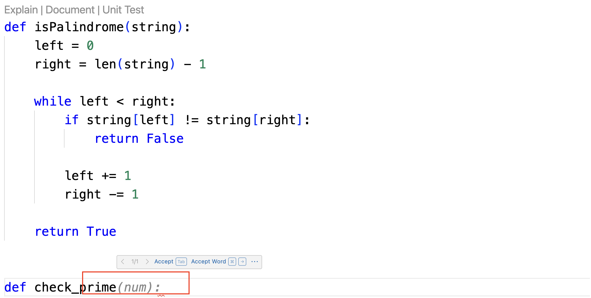
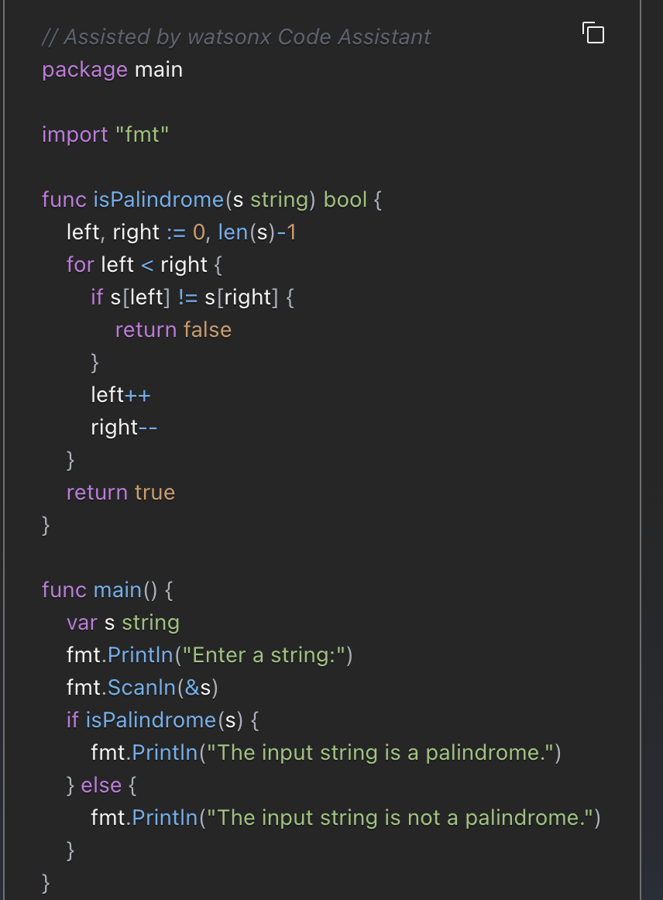

# Lab5: General Programming

This document gives step-by-step guide to finish Lab5, but feel to add in a few of your own attempts.

## Lab5 covers:

- General programming with other languages, including
    - code auto completion
    - code explanation
    - code documentation
    - unit test generation
    - code translation

> **Note:** To help you get started, we've provided some sample code in the `lab5-sample-code` folder.

**To get started, open a new chat session.**

You can preview options for general programming capabilities in any inline functions.


They align with options starting with backslash provided in the chat window.


### 1. Code Auto Completion

When developers write code, WCA will provide real-time inline suggestions.



### 2. Code Explanation

WCA can help explain the details and functions defined in the code sample.

This you can do by clicking the explain option on top of your functions.

Or, you can explain the entire file by typing the following in chat:

```
/explain @UseCase_Code_Palindrome.py
```

> **Note:** Always use the `@` symbol to refer to a specific file. This syntax does not appear in the conversation history.

### 3. Code Documentation

WCA can help generate documentation strings for a given code sample.

> **Note:** Don't forget the `@` symbol to refer to a file. 


### 4. Unit test generation

Similar to what we see for Java, unit test generation is available for other languages.

> **Note:** Don't forget the `@` symbol to refer to a file. 


### 5. Code Translation

Code translation is provided via the following syntax:

```
/translate from SOURCE_LANGUAGE to TARGET_LANGUAGE @REFERENCE_FILE|CODE_SNIPPET
```

> **Note:** You might want to start a new chat session for this command.

Please note from SOURCE_LANGUAGE is an optional argument, and can be skipped while doing translation.

For this lab, we will conver the python palindrom code to go language. Try the following prompt:

```
/translate from python to go @UseCase_Code_Palindrome.py
```


